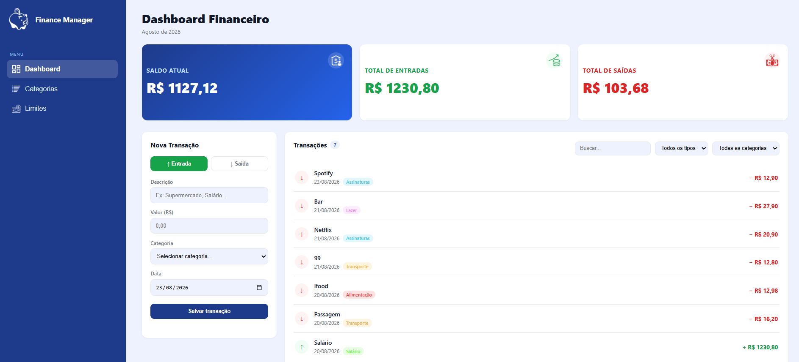

# Finance Manager

Sistema web para controle de finanças pessoais, desenvolvido com Python e Flask, que permite registrar e organizar entradas e saídas financeiras, associar transações a categorias, criar novas categorias, excluir informações e visualizar um dashboard com o resumo financeiro, facilitando o acompanhamento das movimentações.

<p align="center">
  
</p>

## Tecnologias


## Como executar

### 1. Clone o repositório

```bash
git clone https://github.com/seu-usuario/financemanager.git
cd expense-control
```

### 2. Crie e ative o ambiente virtual

**Windows:**

```bash
python -m venv venv
venv\Scripts\activate
```

**Linux/Mac:**

```bash
python -m venv venv
source venv/bin/activate
```

### 3. Instale as dependências

```bash
pip install -r requirements.txt
```

### 4. Configure o banco de dados

Crie o banco MySQL utilizando o arquivo `schema.sql`:

```bash
mysql -u root -p < schema.sql
```

### 5. Configure as variáveis de ambiente

Copie `.env.example` para `.env` e configure as credenciais do seu banco MySQL.

### 6. Execute a aplicação

```bash
python app.py
```
